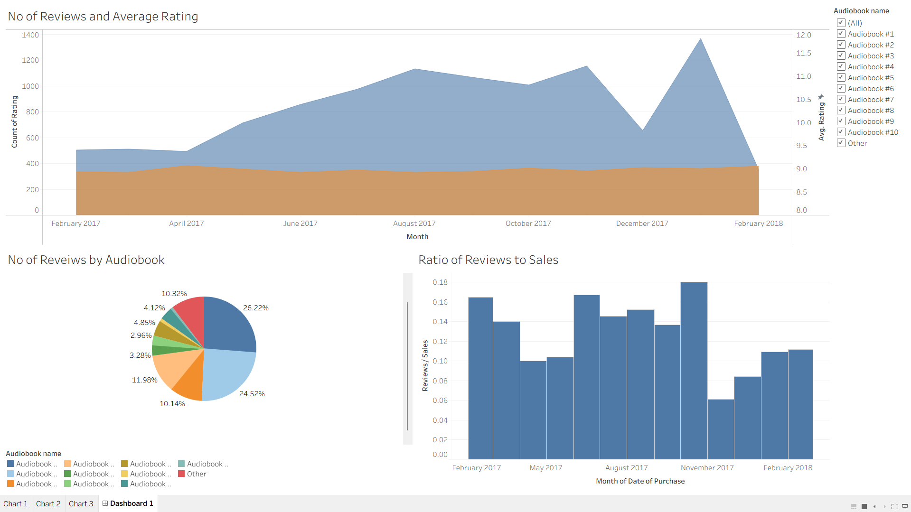

# 📚 Audiobook Sales Dashboard

An interactive **Tableau dashboard** developed to analyze audiobook sales performance, customer reviews, and rating trends. This project demonstrates skills in data visualization, business intelligence, dashboard design, and data-driven storytelling by transforming raw sales and review data into actionable business insights.

## Overview

This project provides an interactive dashboard covering:

- Sales Performance Analysis
- Customer Review Analysis
- Average Rating Trends
- Review Distribution by Audiobook
- Review-to-Sales Ratio
- Interactive Dashboard Filtering
- Business Performance Monitoring
- Data Visualization & Reporting

The dashboard is built using **Tableau** with Excel datasets, enabling users to explore sales and customer engagement through dynamic visualizations.

---

## Repository Structure

```text
Audiobook_Sales_Dashboard/
│
├── src/
│   └── Audiobook_Dashboard_SS.png
│
├── Audiobbok_sales.twb
├── Audiobook-reviews.xlsx
├── Audiobook-sales.xlsx
└── README.md
```

---

## Dashboard Preview



---

## Dashboard Components

### Monthly Reviews & Average Rating

Visualizes customer review trends alongside average ratings over time to identify changes in customer engagement and satisfaction.

**Key Insights**

- Monthly review growth
- Average customer rating trends
- Seasonal engagement patterns

---

### Reviews by Audiobook

Displays the proportion of total reviews received by each audiobook.

**Key Insights**

- Most reviewed audiobooks
- Customer interest distribution
- Popular title identification

---

### Reviews-to-Sales Ratio

Measures customer engagement by comparing review counts against sales volume.

**Key Insights**

- Customer participation rate
- Engagement efficiency
- Product performance comparison

---

### Interactive Filters

The dashboard includes filters that allow users to:

- Analyze individual audiobooks
- Compare multiple audiobook titles
- Explore dynamic visualizations in real time

---

## Key Features

- Interactive Tableau Dashboard
- Time-Series Sales & Review Analysis
- Customer Rating Visualization
- Review Distribution Analysis
- Review-to-Sales Performance Metrics
- Dynamic Filtering & Exploration
- Business Intelligence Reporting

---

## Technologies & Tools

### Business Intelligence

- Tableau Desktop

### Data Source

- Microsoft Excel

### Data Visualization

- Area Charts
- Pie Charts
- Bar Charts
- Interactive Filters

---

## Dataset

The project uses two datasets:

| Dataset | Description |
|---------|-------------|
| **Audiobook-sales.xlsx** | Audiobook sales transactions and purchase data |
| **Audiobook-reviews.xlsx** | Customer reviews and rating information |

---

## Business Insights Generated

- Analyze monthly customer engagement trends.
- Identify audiobooks receiving the highest number of reviews.
- Monitor customer satisfaction through average ratings.
- Compare customer interaction relative to sales performance.
- Support data-driven decision-making using interactive visualizations.

---

## Getting Started

### Clone the Repository

```bash
git clone https://github.com/Pranav-1719/Audiobook_Sales_Dashboard.git
```

### Open the Dashboard

1. Open **Audiobbok_sales.twb** in Tableau Desktop.
2. If prompted, reconnect the Excel datasets.
3. Use the interactive filters to explore dashboard insights.

---

## Future Improvements

- Revenue and Profit KPIs
- Sales Forecasting Dashboard
- Customer Segmentation Analysis
- Genre-wise Performance Analysis
- Geographic Sales Visualization
- Executive KPI Dashboard
- Automated Data Refresh

---

## Author

**Pranav Sankpal**

Computer Science Engineering Student focused on Data Analytics, Business Intelligence, Data Visualization, Machine Learning, and Software Development.

### Connect

- GitHub: https://github.com/Pranav-1719
- LinkedIn: https://www.linkedin.com/in/pranav-sankpal-594b632a9

---
